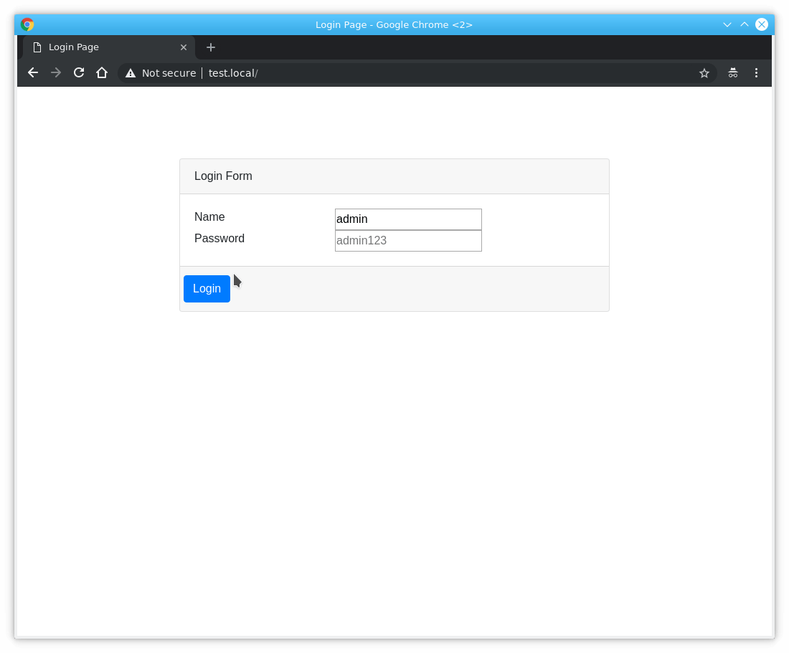
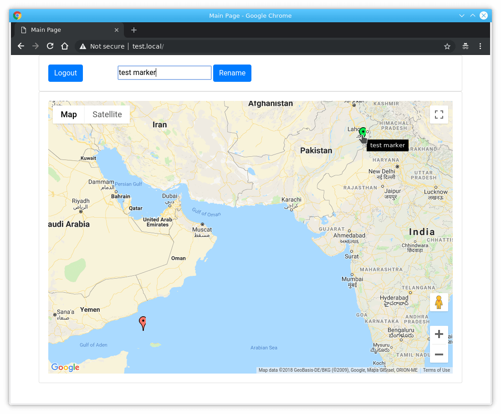
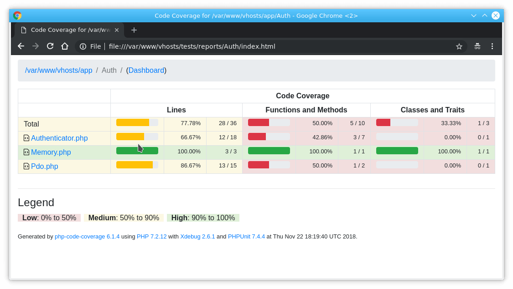

## Test Web App ##

This is a test Web App created from scratch in "vanilla" way.

The following packages should be installed in OS:

 - [Composer](https://getcomposer.org/) - to install [PHPUnit](https://phpunit.de/), [TWig](https://twig.symfony.com/) and [Phinx](https://phinx.org/) (DB migrations)
 - xDebug (code coverage reports, optionally)

Create database **test** manually. Check settings in **config.php** and **phinx.yml**.
 
Run in project root directory:
```sh
composer update
vendor/bin/phinx migrate
vendor/bin/phinx seed:run
vendor/bin/phpunit
```

### TCP receiver ###

To test server open two terminals and run the script:
```sh
php server.php
```
By default server listening port 5000.


In the second terminal send test data. E.g. under Linux you can: 
```sh
echo "#357671030507872#user#4444#AUTOLOW#1#14508989\$GPRMC,123347.000,A,4313.7477,N,02752.4516,E,0.00,284.40,080811,,,D*63##" | nc 127.0.0.1 5000
```

For simplicity server script can be stopped by Ctrl~C.


### Front End ###

Install virtual host for this app and open it in browser. Login page will be shown. Use "admin" as name and "admin123" as password.
   
The main page will appear and the latest POIs will be loaded. The data updated automatically (once per 10 seconds).


Login Page


Main Page


Code coverage page



### Source Code ###

Backend is written with PHP (7.1+) and can be found in **app** directory.

DB migrations are places in **db/migrations** and seeds are in **db/seeds**.

**tests** directory - PHP Unit tests. Reports are generated automatically and will be placed into **tests/reports**. 

Twig was used to separate HTML from PHP. Twig templates can be found in **resources/twig** directory.

JavaScript files was placed to **resources/js**, and SCSS to **resources/scss**.

The simplest ever front-end controller is **index.php** under the **public** directory (DOCUMENT_ROOT). 
Besides there is another AJAX controller **ajax-latest-navigators.php** to simulate Google map auto refresh.
  
Static assets compiled with **webpack**.
 
